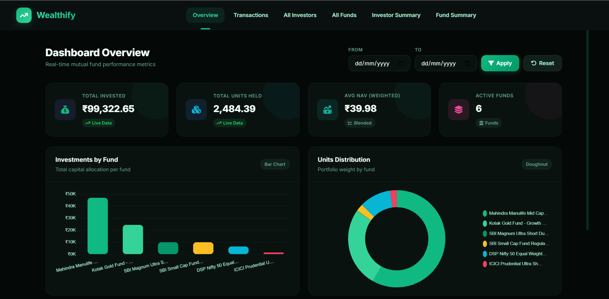
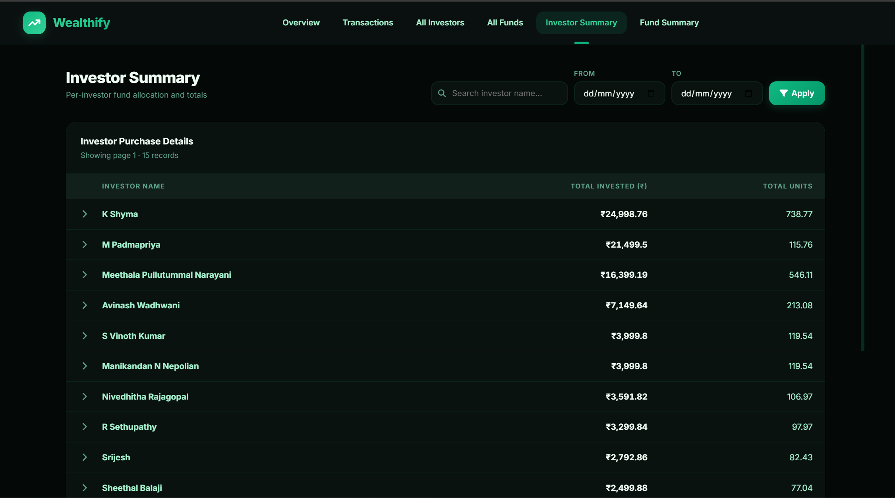
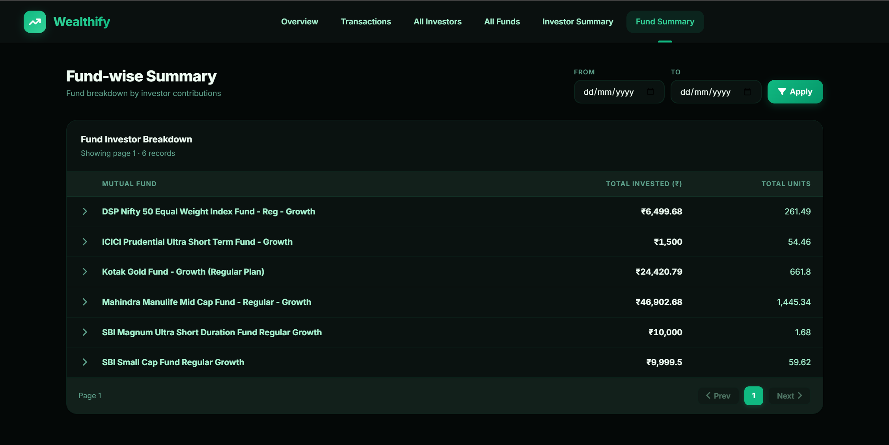
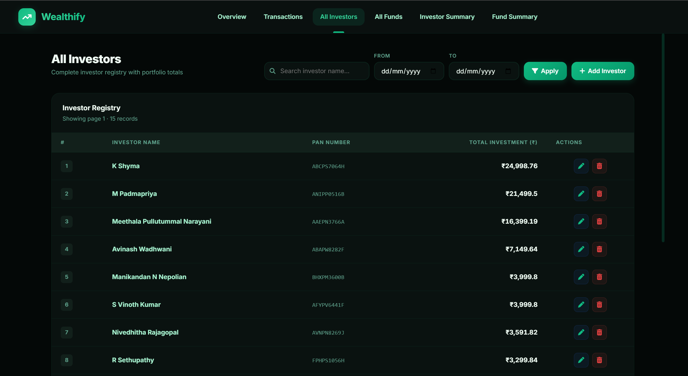
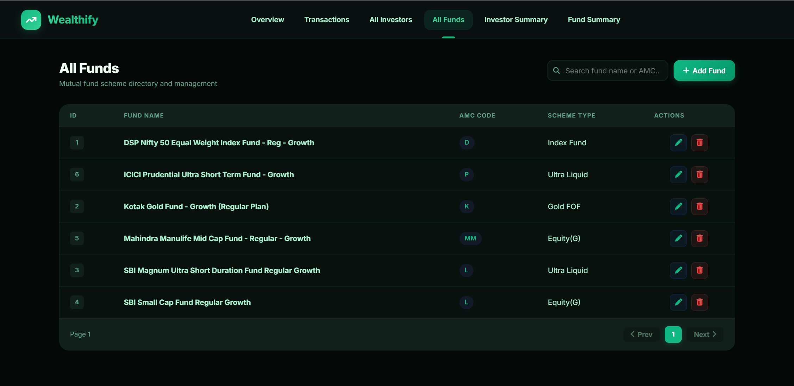
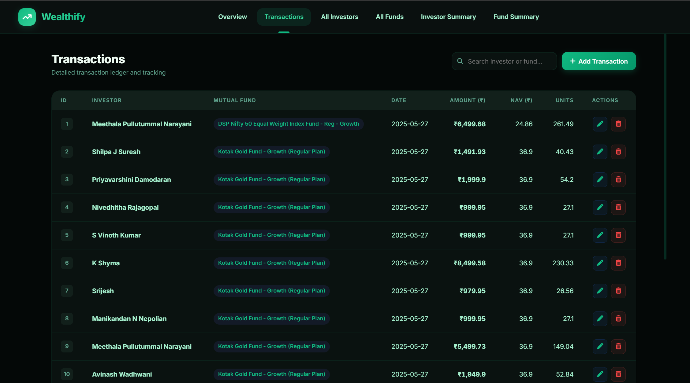

# 📊 Wealthify — Frontend UI

An ultra-sleek, luxury glassmorphic dashboard for mutual fund management.

---

## 🎨 Visual System & Screenshots

### 🖥️ Dashboard Overview


### 👥 Investor & Fund Summary (Drill-Down Trees)
| Investor Summary | Fund-wise Summary |
|---|---|
|  |  |

### 📁 Registries & Transactions
| All Investors | All Funds | Transactions |
|---|---|---|
|  |  |  |


---

## ✨ Key Features
* **Luxury Glassmorphism**: Premium deep obsidian & emerald-green dark mode with custom animations.
* **Dual-Mode Engine**: Live backend PostgreSQL connectivity with seamless offline `localStorage` fallback.
* **Drill-down Trees**: Collapsible accordion grids for dynamic Investor-wise and Fund-wise summaries.
* **Interactive Analytics**: Asset allocation charts and performance trends powered by Chart.js.

---

## 🛠️ Technology Stack
* **Structure**: HTML5 Semantic markup
* **Styles**: Modern Vanilla CSS3 (Custom properties, CSS Grid/Flexbox)
* **Logic**: Vanilla ES6+ JS (Single Page Navigation, Chart.js, Modal managers)

---

## 🚀 Getting Started

### 1. Launch with Live Backend (Recommended)
1. Start the API backend (e.g. `.\start_backend.bat`).
2. Visit **`http://127.0.0.1:8080/`** in your browser.

### 2. Standalone Sandbox Mode (Offline)
1. Double-click `frontend/index.html` to run locally via file system.
2. Or spin up a local server:
   ```bash
   cd frontend
   python -m http.server 3000
   ```
   Open **`http://127.0.0.1:3000/`**.
